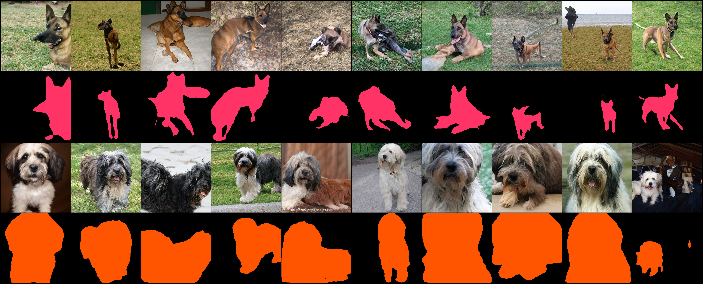

## <p align="center"> BigDatasetGAN: Synthesizing ImageNet with Pixel-wise Annotations</p>

This is the official code for:

#### BigDatasetGAN: Synthesizing ImageNet with Pixel-wise Annotations

[Daiqing Li](https://scholar.google.ca/citations?user=8q2ISMIAAAAJ&hl=en), [Huan Ling](http://www.cs.toronto.edu/~linghuan/), [Seung Wook Kim](https://seung-kim.github.io/seungkim/), [Karsten Kreis](https://scholar.google.de/citations?user=rFd-DiAAAAAJ&hl=de), Adela Barriuso, [Sanja Fidler](http://www.cs.toronto.edu/~fidler/), [Antonio Torralba](https://groups.csail.mit.edu/vision/torralbalab/)\
**[[Paper](https://arxiv.org/abs/2201.04684)] [[Bibtex](https://nv-tlabs.github.io/big-datasetgan/resources/bibtex.txt)] [[Project Page](https://nv-tlabs.github.io/big-datasetgan/)]**

<p align="center">
    
</p>


<p align="center">
    
</p>

## Requirements
* Python 3.7 
* Cuda v11.0+
* gcc v7.3.0
* Pytorch 1.9.0+

## Pretrained BigGAN weights
Our annotation and model are based on BigGAN-512, please download the model from https://tfhub.dev/deepmind/biggan-512/2, store it in `./pretrain` folder. Since the original model is trained using TensorFlow, you need to convert the model weights back to Pytorch, following the instructions here https://github.com/ajbrock/BigGAN-PyTorch/tree/master/TFHub. Notice the model is Licensed under Apache-2.0 issued by DeepMind.

## Dataset preparation
We only release our annotations on sampled [BigGAN](https://github.com/ajbrock/BigGAN-PyTorch/blob/master/LICENSE) images and images from [ImageNet](https://www.image-net.org/index.php) along with its latents used to get the sampled images. For their licenses, please refer to their websites. Notice our dataset release is under the [Creative Commons BY-NC 4.0](https://creativecommons.org/licenses/by-nc/4.0/) license by NVIDIA Corporation. Please see [License](#license) session for details.

1. Download ImageNet from [here](https://www.image-net.org/index.php).
2. Download our annotations `annotations.zip` and latent codes `latents.zip` from [gdrive](https://drive.google.com/drive/folders/1NC0VSZrVZsd1Z_IRSdadyfCfTXMAPsf1). Unzip them into data folder under `./data/`.
3. Process images from ImageNet into our dataset format. Run the following script
```
python prepare_imagenet_images.py --imagenet_dir [path to imagenet dir] --dataset_dir ./data/
```
4. Prepare images generated from BigGAN. Please download the pretrained weights following [this](#pretrained-biggan-weights) session. And run
```
python prepare_biggan_images.py --biggan_ckpt ./pretrain/biggan-512.pth --dataset_dir ./data/
```
After the processing steps, you should have data folder structure like this
```
data
|
└───annotations
│   |
│   └───biggan512
│   |   │   n01440764
│   |   │   ...
|   └───real-random-list.txt
└───images
│   |
│   └───biggan512
│   |   │   n01440764
│   |   │   ...
|   └───real-random
│       │   n01440764
│       │   ...
└───latents
│   |
│   └───biggan512
│   |   │   n01440764
│   |   │   ...
```

## Training
After the dataset preparation, we now can train BigDatasetGAN to synthesize dataset.

Run the following
```
python train.py --gan_ckpt ./pretrain/biggan-512.pth \
                --dataset_dir ./data/ \
                --save_dir ./logs/
```

You can monitor the training progress in tensorboard, as well as the training predictions in logs dir.

By default, the training runs 5k iteration with a batch size of 4, you can adjust it for the best capacity.

## Sampling dataset
After the training is done, we can synthesize ImageNet with pixel-wise labels.

Run the following
```
python sample_dataset.py --ckpt [path to your pretrained BigDatasetGAN weights] \
                         --save_dir ./dataset_viz/ \
                         --class_idx 225, 200, [you can give it more with ImagetNet class idx] \
                         --samples_per_class 10
                         --z_var 0.9
```

<p align="center">
    
</p>


As an example, here we sample class 225 and 200 with 10 samples each.

## License 
For any code dependency related to BigGAN, the license is under the MIT License, see https://github.com/ajbrock/BigGAN-PyTorch/blob/master/LICENSE.

The work BigDatasetGAN code is released under Creative Commons BY-NC 4.0 license, full text at http://creativecommons.org/licenses/by-nc/4.0/legalcode.

The dataset of BigDatasetGAN is released under the [Creative Commons BY-NC 4.0](https://creativecommons.org/licenses/by-nc/4.0/) license by NVIDIA Corporation. You can **use, redistribute, and adapt** the material for **non-commercial purposes**, as long as you give appropriate credit by **citing our paper** and **indicating any changes** that you've made.

## Citation 

Please cite the following paper if you used the code in this repository.

```
@misc{li2022bigdatasetgan,
      title={BigDatasetGAN: Synthesizing ImageNet with Pixel-wise Annotations}, 
      author={Daiqing Li and Huan Ling and Seung Wook Kim and Karsten Kreis and Adela Barriuso and Sanja Fidler and Antonio Torralba},
      year={2022},
      eprint={2201.04684},
      archivePrefix={arXiv},
      primaryClass={cs.CV}
}
```


